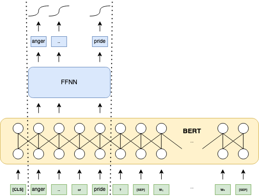
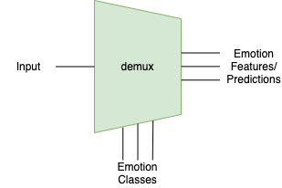
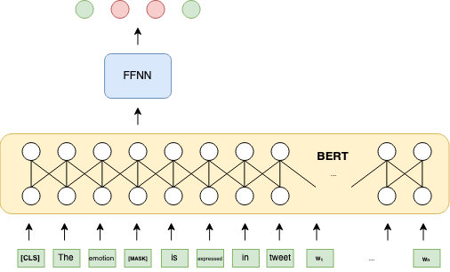
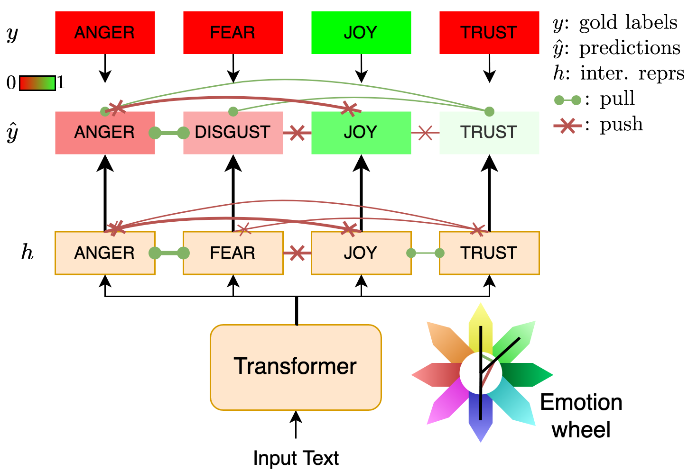
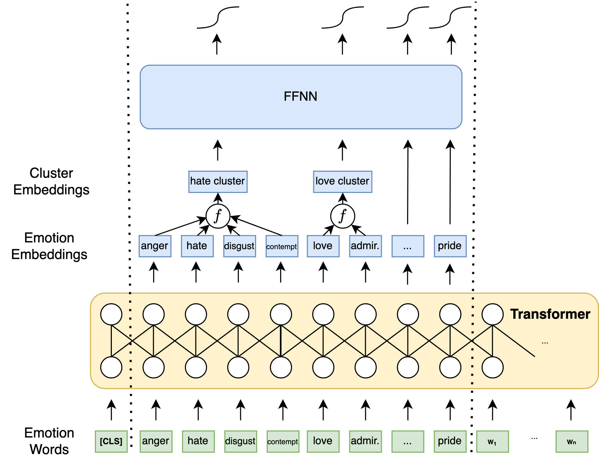

# Emotion Recognition using Emotion Embeddings, MLM, and emotion correlations

This repo contains code and execution scripts for ICASSP '23 papers [Leveraging Label Correlations in a Multi-label Setting: A Case Study in Emotion](https://arxiv.org/abs/2210.15842) and [Using Emotion Embeddings to Transfer Knowledge Between Emotions, Languages, and Annotation Formats](https://arxiv.org/abs/2211.00171).

## Annotate your documents with our pretrained models

We have tested *this* functionality with `Python 3.10.13`, so be sure to create a suitable `Python virtual environment`. With your environment activated, install our dependencies:

```bash
pip install .
```

Then, *download* and unzip our pretrained models:

| Type | Link |
| --- | --- |  
| [SemEval 2018 Task 1](https://aclanthology.org/S18-1001.pdf) | [model](https://drive.google.com/file/d/1Lksx2Yl0-U1Fx8jEl3Oq0k2tkNi4aXYb/view?usp=share_link) |
| [GoEmotions](https://aclanthology.org/S18-1001.pdf) | [model](https://drive.google.com/file/d/1OMnLpBZv35Z_IE0YkGxSYRUy3gcllWEI/view?usp=share_link) |
| [Paletz](https://link.springer.com/article/10.3758/s13428-023-02195-1) | [model](https://drive.google.com/file/d/1LPh-iEpdqhpO9TqoU-BCZHYiZ4c2ImTq/view?usp=share_link) |

These folders contain the model parameters, brief model configuration files, and brief README of the sequence of training. You can use our existing emotion taxonomies in [emotion_configs](./emotion_configs/), or define your own likewise. It is highly recommended that you use one that is compatible with the model's latest training stage as delineated in its README file for the best results.

Finally, to get the *predictions*, run the `annotate.py` script:

```bash
python annotate.py --pretrained-folder /path/to/pretrained/model/folder \
--emotion-config ./emotions_config/your-pick.json --domain twitter \
--input-filename /path/to/your/input --out ./emotion-annotations.jsonl \
--device cuda:0 --text-column text --id-column id
```

You can use a `json`, `csv`, or `jsonl` as input. For reference about the format of the input files, check the [example_inputs](./example_inputs/). Note that if your `csv` or `jsonl` files use a different key for the text and the ID of each example, you can specify that with `text-column` and `id-column`. The output file is always a `jsonl` file. Use `--help` to see the rest of the arguments.

## Leveraging Label Correlations in a Multi-label Setting: A Case Study in Emotion

This repo contains code for `Demux` and `MEmo`, emotion recognition models using two different types of language prompts. We study how we can leverage relationships between emotions. We do so at two levels, using word associations and with additional losses.

### `Demux`
---

Heavily inspired from [SpanEmo](https://github.com/gchochla/SpanEmo), `Demux` includes the names of the categories (here, emotions) in the input as its first input sequence, and the actual input as the second sequence. The contextual embeddings for each emotion are used to get a probability for each.

The contextual embeddings of the emotion words are eseentially label embeddings, so we leverage that to perform operations on them and transfer knowledge to different annotation formats.



`Demux` takes advantage of word-level associations in the input to transfer knowledge betwwen emotions. Our experiments show that emotion recognition can be transferred in a zero-shot manner to new emotions, and that associations between emotions words already capture the relationships between emotions to a large extend. 

#### Why `Demux` (short for 'Demultiplexer')?



We can consider the emotions classes as *selecting* the features that the Transformer is going to output from the output.

### `MEmo`

---

`MEmo` uses a declarative prompt about the emotional content of the input text, but the actual emotions have been replaced by a `[MASK]` token. We either build a classifier on top of the contextual embeddings of the `[MASK]` token, or use the pretrained MLM head and grab the logits of the emotion tokens.



### Regularization

---



We induce label-correlation awareness by pulling together or pushing apart representations of pairs of emotions. This can be achieved at the level of intermediate representations $h$, and at the level of predictions $\hat{y}$. Prediction pairs can be regularized using the labels $y$, by pulling emotions with the same gold labels together, otherwise pushing them apart. Representation pairs can be regularized in the same way, but we can also use prior relationships between them, which can conflict current labels. Each pair's regularization term can be modulated by the strength of the relationship of the pair.

### Extra Results from Demux and MEmo

Individual F1 scores for each emotion in each language in the test sets for SemEval 2018 Task 1 E-c, for the Demux setting "intra ρ e^y":

| Emotion      | English       | Spanish       | Arabic        |
|--------------|---------------|---------------|---------------|
| anger        | 79.4 &pm; 0.3 | 74.9 &pm; 0.7 | 78.8 &pm; 0.4 |
| anticipation | 29.5 &pm; 1.7 | 43.7 &pm; 3.6 | 14.7 &pm; 2.6 |
| disgust      | 75.8 &pm; 0.5 | 47.3 &pm; 1.0 | 55.6 &pm; 1.7 |
| fear         | 75.1 &pm; 0.6 | 69.2 &pm; 0.7 | 73.5 &pm; 0.8 |
| joy          | 87.1 &pm; 0.3 | 81.8 &pm; 0.7 | 81.7 &pm; 0.7 |
| love         | 63.4 &pm; 0.5 | 68.0 &pm; 0.8 | 75.2 &pm; 0.8 |
| optimism     | 75.4 &pm; 0.6 | 39.4 &pm; 1.0 | 74.4 &pm; 1.1 |
| pessimism    | 39.3 &pm; 1.9 | 43.8 &pm; 0.9 | 38.7 &pm; 2.9 |
| sadness      | 73.5 &pm; 0.2 | 67.2 &pm; 0.7 | 72.4 &pm; 0.6 |
| surprise     | 23.3 &pm; 1.3 | 29.8 &pm; 1.2 | 0.0 &pm; 0.0  |
| trust        | 11.5 &pm; 1.0 | 31.3 &pm; 1.6 | 27.2 &pm; 3.8 |

The same patterns are observed for MEmo as well. The support for each emotion can be seen in the original dataset paper.

We also present our results for GoEmotions (3 runs on test set), derived from Reddit and with 27 emotions (so more granular choice of emotions, resulting in only a very small subset of it having more than 1 emotion -- in particular 13%, causing our intra-class regularization to very rarely push predictions upwards). Note that we use the make surface-level changes to the preprocessor used for tweets to preprocess the text from Reddit:

| Model             | Macro F1      | Micro F1      |
|-------------------|---------------|---------------|
| Demux             | 49.2 &pm; 0.5 | 54.1 &pm; 0.1 |
| Demux intra 1 e^y | 52.3 &pm; 0.6 | 58.1 &pm; 0.6 |
| Demux intra ρ e^y | 52.1 &pm; 0.6 | 58.2 &pm; 0.6 |
| MEmo intra 1 e^y  | 44.0 &pm; 0.9 | 56.3 &pm; 0.1 |

We see a large increase in performance from the inclusion of the local regularization terms.

<small>(PS: Note GoEmotions results are preliminary)</small>

## Using Emotion Embeddings to Transfer Knowledge Between Emotions, Languages, and Annotation Formats

We extend `Demux` to work with clusters of emotions. We achieve this by performing operations on the emotion embeddings produced by regular `Demux`.



Moreover, since emotions are specified in the input, we can dynamically add and remove emotions from our predictions. We show that `Demux` can achieve zero-shot tranfer to new emotions and annotation formats, like clusters of emotions. We lso show that the zero-shot transfer is successful even with a change in language.


## Installation

This has been tested with `Python 3.7.4`. To simply run, install as package with:

```bash
pip install -e .
```

If you want to alter the implementation, we suggest you install with:

```bash
pip install -e .[dev]
```

(Note to zsh users: escape `[` and `]`)

## Extend to other datasets and tasks

Our trainers are general-purpose enough to allow use with different datasets, tasks, models, etc. All you need is:

* Dataset: implement `__getitem__` to return a dictionary of values and the labels. The keys should ideally match the ones from HuggingFace `transformer` models. If inheriting from some subclass of `emorec.emorec_utils.dataset.EmotionDataset` class, you only have to implement the `load_dataset` and `encode_plus` method. The former should return a list of strings and a tensor of labels. `encode_plus` is the method that tokenizes the input. We use (pseudo) Mixins to implement it, as it is mostly constant across datasets for a specific model. Note that the category names, which are necessary for `Demux`, fall under `emotions`, `english_emotions`, `all_emotions`, etc., so it may be cumbersome when trasfering to a different task, hence consider defining your classes anew. Demux also requires `class_inds`, a list of either tensors or lists of tensors, which specify which tokens to grab per input. List of lists of tensors should be used for clusters.

* Trainer:  the trainer also assumes emotion datasets, so it uses `dataset.emotions` (as discussed above), etc. However, in terms of the actual training, it should be extensible to other tasks. The main trainer, `emorec.emorec_utils.trainer.SemEval2018Task1EcTrainer`, includes all regularization losses, and other utilities presented in the papers. For base methods, look at `emorec.trainer.BaseTrainer`.

* Model: any nn.Module. The trainer contains utilities to grab specific outputs of the model. `Demux` and `MEmo` have two outputs by default, the logits and intermediate representations (`None`s when no intermediate representations exist). Look at our models in `emorec/models/` to see how to implement `from_pretrained` so you can load any pretrained LM into your frameworks.

* Command-line arguments in the scripts: All the arguments one wants to access when configuring each run should be placed inside the class variable `argparse_args` of the appropriate class in the format that can be seen for example in `emorec.trainer.BaseTrainer`. Moreover, they probably need to be added in `emorec.train_utils.MyTrainingArgument` similarly to the other arguments there. Then, under the experiments folder, each new script should grab these to create an `ArgumentParser` (like we have done).

* Logging system: see below.

## Usage

We provide the scripts which execute all the experiments to replicate the results of the paper, when possible. To compare between different local and global losses, run the [correlation](#leveraging-label-correlations-in-a-multi-label-setting-a-case-study-in-emotion) scripts:

```bash
chmod +x scripts/correlation-experiments-semeval.sh
scripts/correlation-experiments-semeval.sh -c 0 -r 10 -d /path/to/semeval/root # c: cuda, r: runs
```

and `scripts/correlation-experiments-semeval-test.sh` for the test results.

To run the [knowledge transfer experiments](#using-emotion-embeddings-to-transfer-knowledge-between-emotions-languages-and-annotation-formats), follow the same recipe for the rest of the of the bash scripts in `./scripts`, except for `french-elections.sh`, which requires the french election data (and the extra arguments `-f /path/to/french/data` and `-e /path/to/experiment/logs`). We nonetheless provide the scripts and the necessary classes to aid researcher who want to repurpose the model for their needs: `emorec.emorec_utils.dataset.FrenchElectionEmotionClusterDataset`, `emorec.emorec_utils.trainer.FrenchElectionTrainer`, and similarly for `emorec.models.demux` and `emorec.models.memo`.

The project's structure follows the `transformers` library. Things to keep in mind when extending the scripts:

We have implemented our own logging system to keep an orderly track of experiments, which we hope to extend in the future to its own module. It can be found in `emorec.logging_utils`. What you probably need to know is that it produces the folder `experiment_logs`, followed by a specific folder for the model+dataset (so different subfolder for `Demux` v. `MEmo`, different subfolder for `SemEval` v. `GoEmotions`). In that subfolder, different experiment subfolders per configuration are created. The name of each specific experiment subfolder contains some important information like which models were used, which splits, etc. The final integer is used to differentiate runs with different hyperparameters if they do not appear in the main name (the same experiment ran twice will log additional experiments in the same subfolder). AN example can be seen below:

```
experiment_logs/
└── DemuxSemEval
    ├── Arabic(train),Arabic(dev),None,bert-base-arabertv02-twitter,None,None,cossim,False,0.2,intra_exp_diff,False,None_0
    ├── Arabic(train),Arabic(dev),None,twitter-xlm-roberta-base-sentiment,1.0,None,cossim,False,0.2,intra_exp_diff,False,None_0
    ├── Arabic(train),Arabic(dev),None,twitter-xlm-roberta-base-sentiment,1.0,None,cossim,False,0.2,intra_exp_diff,False,None_1
    ├── Arabic(train),Arabic(dev),None,twitter-xlm-roberta-base-sentiment,1.0,None,cossim,False,0.2,intra_exp_diff,False,None_2
    ├── English+Arabic(train),English+Arabic(dev),None,twitter-xlm-roberta-base-sentiment,Spanish(train;dev),0.0,None,cossim,False,0.2,intra_exp_diff,False,None_0
    ├── English+Spanish+Arabic(train),Arabic(dev),None,twitter-xlm-roberta-base-sentiment,1.0,None,cossim,False,0.2,intra_exp_diff,False,None_0
    ├── English+Spanish+Arabic(train),Arabic(dev),None,twitter-xlm-roberta-base-sentiment,1.0,None,cossim,False,0.2,intra_exp_diff,False,None_1
    ├── English+Spanish+Arabic(train;dev),None,twitter-xlm-roberta-base-sentiment,0.0,None,cossim,False,0.2,intra_exp_diff,False,None_0
    ├── English+Spanish+Arabic(train),English(dev),None,twitter-xlm-roberta-base-sentiment,1.0,None,cossim,False,0.2,intra_exp_diff,False,None_0
    ├── English+Spanish+Arabic(train),English(dev),None,twitter-xlm-roberta-base-sentiment,1.0,None,cossim,False,0.2,intra_exp_diff,False,None_1
    ├── English+Spanish+Arabic(train),English+Spanish+Arabic(dev),model.pt,twitter-xlm-roberta-base-sentiment,0.0,None,cossim,False,0.2,intra_exp_diff,False,None_0
    ├── English+Spanish+Arabic(train),English+Spanish+Arabic(dev),model.pt,twitter-xlm-roberta-base-sentiment,0.0,None,cossim,False,0.2,intra_exp_diff,False,None_1
    ├── English+Spanish+Arabic(train),English+Spanish+Arabic(dev),model.pt,twitter-xlm-roberta-base-sentiment,0.0,None,cossim,False,0.2,intra_exp_diff,False,None_2
    ├── English+Spanish+Arabic(train),English+Spanish+Arabic(dev),None,bert-base-multilingual-uncased,0.0,None,cossim,False,0.2,intra_exp_diff,False,None_0
    ├── English+Spanish+Arabic(train),English+Spanish+Arabic(dev),None,bert-base-multilingual-uncased,0.5,None,cossim,False,0.2,intra_exp_diff,False,None_0
    ├── English+Spanish+Arabic(train),English+Spanish+Arabic(dev),None,bert-base-multilingual-uncased,1.0,None,cossim,False,0.2,intra_exp_diff,False,None_0
    ├── English+Spanish+Arabic(train),English+Spanish+Arabic(dev),None,twitter-xlm-roberta-base-sentiment,0.0,None,cossim,False,0.2,intra_exp_diff,False,None_0
    ├── English+Spanish+Arabic(train),English+Spanish+Arabic(dev),None,twitter-xlm-roberta-base-sentiment,0.5,None,cossim,False,0.2,intra_exp_diff,False,None_0
    ├── English+Spanish+Arabic(train),English+Spanish+Arabic(dev),None,twitter-xlm-roberta-base-sentiment,1.0,None,cossim,False,0.2,intra_exp_diff,False,None_0
    ├── English+Spanish+Arabic(train),Spanish(dev),None,twitter-xlm-roberta-base-sentiment,1.0,None,cossim,False,0.2,intra_exp_diff,False,None_0
    ├── English+Spanish+Arabic(train),Spanish(dev),None,twitter-xlm-roberta-base-sentiment,1.0,None,cossim,False,0.2,intra_exp_diff,False,None_1
    ├── English+Spanish(train),English+Spanish(dev),None,twitter-xlm-roberta-base-sentiment,Arabic(train;dev),0.0,None,cossim,False,0.2,intra_exp_diff,False,None_0
    ├── English+Spanish-Tr+Arabic(train),Spanish-Tr(dev),None,twitter-xlm-roberta-base-sentiment,1.0,None,cossim,False,0.2,intra_exp_diff,False,None_0
    ├── English+Spanish-Tr+Arabic(train),Spanish-Tr(dev),None,twitter-xlm-roberta-base-sentiment,1.0,None,cossim,False,0.2,intra_exp_diff,False,None_1
    ├── English(train),English(dev),None,bertweet-base,None,None,cossim,False,0.2,intra_exp_diff,False,None_0
    ├── English(train),English(dev),None,twitter-xlm-roberta-base-sentiment,1.0,None,cossim,False,0.2,intra_exp_diff,False,None_0
    ├── English(train),English(dev),None,twitter-xlm-roberta-base-sentiment,1.0,None,cossim,False,0.2,intra_exp_diff,False,None_1
    ├── English(train),English(dev),None,twitter-xlm-roberta-base-sentiment,anger,None,None,cossim,False,0.2,intra_exp_diff,False,None_0
    ├── English(train),English(dev),None,twitter-xlm-roberta-base-sentiment,anger,None,None,cossim,False,0.2,intra_exp_diff,False,None_1
    ├── English(train),English(dev),None,twitter-xlm-roberta-base-sentiment,anger,None,None,cossim,False,0.2,intra_exp_diff,False,None_2
    ├── English(train),English(dev),None,twitter-xlm-roberta-base-sentiment,joy,None,None,cossim,False,0.2,intra_exp_diff,False,None_0
    ├── English(train),English(dev),None,twitter-xlm-roberta-base-sentiment,joy,None,None,cossim,False,0.2,intra_exp_diff,False,None_1
    ├── English(train),English(dev),None,twitter-xlm-roberta-base-sentiment,joy,None,None,cossim,False,0.2,intra_exp_diff,False,None_2
    ├── English(train),English(dev),None,twitter-xlm-roberta-base-sentiment,pessimism,None,None,cossim,False,0.2,intra_exp_diff,False,None_0
    ├── English(train),English(dev),None,twitter-xlm-roberta-base-sentiment,pessimism,None,None,cossim,False,0.2,intra_exp_diff,False,None_1
    ├── English(train),English(dev),None,twitter-xlm-roberta-base-sentiment,pessimism,None,None,cossim,False,0.2,intra_exp_diff,False,None_2
    ├── English(train),English(dev),None,twitter-xlm-roberta-base-sentiment,trust,None,None,cossim,False,0.2,intra_exp_diff,False,None_0
    ├── English(train),English(dev),None,twitter-xlm-roberta-base-sentiment,trust,None,None,cossim,False,0.2,intra_exp_diff,False,None_1
    ├── English(train),English(dev),None,twitter-xlm-roberta-base-sentiment,trust,None,None,cossim,False,0.2,intra_exp_diff,False,None_2
    ├── French-Tr(train;dev),None,bertweetfr-base,None,None,cossim,False,0.2,intra_exp_diff,False,None_0
    ├── French-Tr(train;dev),None,bertweetfr-base,None,None,cossim,False,0.2,intra_exp_diff,False,None_1
    ├── French-Tr(train),French-Tr(dev),None,bertweetfr-base,None,None,cossim,False,0.2,intra_exp_diff,False,None_0
    ├── Spanish+Arabic(train),Spanish+Arabic(dev),None,twitter-xlm-roberta-base-sentiment,English(train;dev),0.0,None,cossim,False,0.2,intra_exp_diff,False,None_0
    ├── Spanish(train),Spanish(dev),None,robertuito-sentiment-analysis,None,None,cossim,False,0.2,intra_exp_diff,False,None_0
    ├── Spanish(train),Spanish(dev),None,twitter-xlm-roberta-base-sentiment,1.0,None,cossim,False,0.2,intra_exp_diff,False,None_0
    ├── Spanish(train),Spanish(dev),None,twitter-xlm-roberta-base-sentiment,1.0,None,cossim,False,0.2,intra_exp_diff,False,None_1
    ├── Spanish(train),Spanish(dev),None,twitter-xlm-roberta-base-sentiment,1.0,None,cossim,False,0.2,intra_exp_diff,False,None_2
    ├── Spanish-Tr(train),Spanish-Tr(dev),None,twitter-xlm-roberta-base-sentiment,1.0,None,cossim,False,0.2,intra_exp_diff,False,None_0
    └── Spanish-Tr(train),Spanish-Tr(dev),None,twitter-xlm-roberta-base-sentiment,1.0,None,cossim,False,0.2,intra_exp_diff,False,None_1
```

The name of each specific experiment subfolder contains some important information like which models were used, which splits, etc. The final integer is used to differentiate runs with different hyperparameters if they do not appear in the main name (the same experiment ran twice will log additional experiments in the same subfolder). Each of these subfolders look something like:

```
English(train),English(dev),None,twitter-xlm-roberta-base-sentiment,1.0,None,cossim,False,0.2,intra_exp_diff,False,None_0/
├── aggregated_metrics.yml
├── metrics.yml
├── obj.pkl
├── params.yml
└── plots
    ├── anger_f1,anticipation_f1,disgust_f1,fear_f1,joy_f1,love_f1,optimism_f1,pessimism_f1,sadness_f1,surprise_f1,trust_f1.png
    ├── eval_loss.png
    ├── eval_regularization_loss.png
    ├── jaccard_score.png
    ├── macro_f1.png
    ├── micro_f1.png
    ├── regularization_loss.png
    └── train_loss.png
```

`aggregated_metrics.yml` contains the mean and the standard deviation of all logged metrics across multiple runs for the epoch designated as the final one (e.g. simple training will use the last epoch, early stopping will use the corresponding step, see example below), `metrics.yml` contains all the logged metrics, `params.yml` contains the hyperparameter configuration, `plots` contains plots of the metrics that are logged across all training (not final metrics, e.g. those of the test set), and `obj.pkl` contains the logger object, which you can re-load by using the load_existent method of vault.logging_utils.ExperimentHandler. Here, you will also find your saved models. An example of aggregated metrics could be:

```
? ''
: best_train_loss: 0.0016+-0.0002
  test_eval_accuracy: 0.7563+-0.0084
  test_eval_loss: 1.5356+-0.0650
  test_macro_f1_score: 0.6997+-0.0171
```

The name of the subfolder is dictated by the user by using `./emorec/logging_utils/ExperimentHandler.name_params(list_of_param_names)`, like we do in our `experiments` scripts.
Note that for consistency the names are sorted, so you have to look out for which value means what in the folder subname (use underscores to push names to the strat of the subfolder).
If you want to introduce new hyperparameters, then, given that the name of the experiment subfolders don't change, if the new hyperparameters are `False` or `None` when they are not used (in other words the experiment is the same as before), the handler will indeed consider them inactive and the experiment equivalent with a previous ones.
