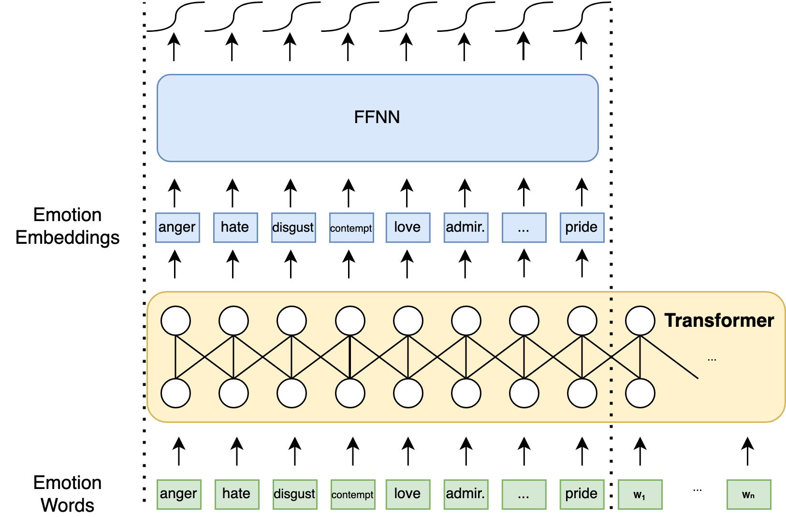

# Demux & MEmo

## Emotion Recognition

This repo contains code for `Demux` and `MEmo` (links to papers coming soon), emotion recognition models using two different types of language prompt. We study how we can leverage relationships between emotions. We do so at two levels, using word associations and with additional losses.

## `Demux`

Heavily inspired from [SpanEmo](https://github.com/gchochla/SpanEmo), `Demux` includes the names of the categories (here, emotions) in the input as its first input sequence, and the actual input as the second sequence. The contextual embeddings for each emotion are used to get a probability for each.

The contextual embeddings of the emotion words are eseentially label embeddings, so we leverage that to perform operations on them and transfer knowledge to different annotation formats.



`Demux` takes advantage of word-level associations in the input to transfer knowledge betwwen emotions. Our experiments show that emotion recognition can be transferred in a zero-shot manner to new emotions, and that associations between emotions words already capture the relationships between emotions to a large extend. 

### Why `Demux` (short for 'Demultiplexer')?


We can consider the emotions classes as *selecting* the features that the Transformer is going to output from the output.

## `MEmo`

`MEmo` uses a declarative prompt about the emotional content of the input text, but the actual emotions have been replaced by a `[MASK]` token. We either build a classifier on top of the contextual embeddings of the `[MASK]` token, or use the pretrained MLM head and grab the logits of the emotion tokens.


## Regularization


{We induce label-correlation awareness by pulling together or pushing apart representations of pairs of emotions. This can be achieved at the level of intermediate representations $h$, and at the level of predictions $\hat{y}$. Prediction pairs can be regularized using the labels $y$, by pulling emotions with the same gold labels together, otherwise pushing them apart. Representation pairs can be regularized in the same way, but we can also use prior relationships between them, which can conflict current labels. Each pair's regularization term can be modulated by the strength of the relationship of the pair.

## Installation

This has been tested with `Python 3.7.4`. To simply run, install as package with:

```bash
pip install -e .
```

If you want to alter the implementation, we suggest you install with:

```bash
pip install -e .[dev]
```

(Note to zsh users: escape `[` and `]`)

## Usage

We provide the scripts which execute all the experiments to replicate the results of the paper, when possible. To compare between different local and global losses, run correlation experiments script:

```bash
chmod +x scripts/correlation-experiments-semeval.sh
scripts/correlation-experiments-semeval.sh -c 0 -r 10 -d /path/to/semeval/root # c: cuda, r: runs
```

and `scripts/correlation-experiments-semeval-test.sh` for the test results.

To run the multilingual, zero-shot, and cluster experiments, follow the same recipe for the rest of the of the bash scripts in `./scripts`, except for `french-elections.sh`, which requires the french election data (and the extra argument `-f /path/to/french/data`). We nonetheless provide the scripts and the necessary classes to aid researcher who want to repurpose the model for their needs: `./emorec/emorec_utils/dataset/FrenchElectionEmotionClusterDataset`, `./emorec/emorec_utils/trainer/FrenchElectionTrainer`, and similarly for `./emorec/models/demux` and `./emorec/models/memo`.

The project's structure follows the `transformers` library. Things to keep in mind when extending the scripts:

All the arguments on wants to access when configuring each run should be placed inside the class variable `argparse_args` of the appropriate class in the format that can be seen for example in `./emorec/trainer/BaseTrainer`. Moreover, they probably need to be added in `./emorec/train_utils/MyTrainingArgument` similarly to the other arguments there.

We have implemented our own logging system to keep an orderly track of experiments, which we hope to extend in the future to its own module. It can be found in `./emorec/logging_utils.py`. What you probably need to know is that it produces the folder `experiment_logs`, followed by a specific folder for the model+dataset (so different subfolder for `Demux` v. `MEmo`, different subfolder for `SemEval` v. `GoEmotions`). In that subfolder, different experiment subfolders per configuration are created. The name of each specific experiment subfolder contains some important information like which models were used, which splits, etc. The final integer is used to differentiate runs with different hyperparameters if they do not appear in the main name (the same experiment ran twice will log additional experiments in the same subfolder). AN example can be seen below:

```
experiment_logs/
└── DemuxSemEval
    ├── Arabic(train),Arabic(dev),None,bert-base-arabertv02-twitter,None,None,cossim,False,0.2,intra_exp_diff,False,None_0
    ├── Arabic(train),Arabic(dev),None,twitter-xlm-roberta-base-sentiment,1.0,None,cossim,False,0.2,intra_exp_diff,False,None_0
    ├── Arabic(train),Arabic(dev),None,twitter-xlm-roberta-base-sentiment,1.0,None,cossim,False,0.2,intra_exp_diff,False,None_1
    ├── Arabic(train),Arabic(dev),None,twitter-xlm-roberta-base-sentiment,1.0,None,cossim,False,0.2,intra_exp_diff,False,None_2
    ├── English+Arabic(train),English+Arabic(dev),None,twitter-xlm-roberta-base-sentiment,Spanish(train;dev),0.0,None,cossim,False,0.2,intra_exp_diff,False,None_0
    ├── English+Spanish+Arabic(train),Arabic(dev),None,twitter-xlm-roberta-base-sentiment,1.0,None,cossim,False,0.2,intra_exp_diff,False,None_0
    ├── English+Spanish+Arabic(train),Arabic(dev),None,twitter-xlm-roberta-base-sentiment,1.0,None,cossim,False,0.2,intra_exp_diff,False,None_1
    ├── English+Spanish+Arabic(train;dev),None,twitter-xlm-roberta-base-sentiment,0.0,None,cossim,False,0.2,intra_exp_diff,False,None_0
    ├── English+Spanish+Arabic(train),English(dev),None,twitter-xlm-roberta-base-sentiment,1.0,None,cossim,False,0.2,intra_exp_diff,False,None_0
    ├── English+Spanish+Arabic(train),English(dev),None,twitter-xlm-roberta-base-sentiment,1.0,None,cossim,False,0.2,intra_exp_diff,False,None_1
    ├── English+Spanish+Arabic(train),English+Spanish+Arabic(dev),model.pt,twitter-xlm-roberta-base-sentiment,0.0,None,cossim,False,0.2,intra_exp_diff,False,None_0
    ├── English+Spanish+Arabic(train),English+Spanish+Arabic(dev),model.pt,twitter-xlm-roberta-base-sentiment,0.0,None,cossim,False,0.2,intra_exp_diff,False,None_1
    ├── English+Spanish+Arabic(train),English+Spanish+Arabic(dev),model.pt,twitter-xlm-roberta-base-sentiment,0.0,None,cossim,False,0.2,intra_exp_diff,False,None_2
    ├── English+Spanish+Arabic(train),English+Spanish+Arabic(dev),None,bert-base-multilingual-uncased,0.0,None,cossim,False,0.2,intra_exp_diff,False,None_0
    ├── English+Spanish+Arabic(train),English+Spanish+Arabic(dev),None,bert-base-multilingual-uncased,0.5,None,cossim,False,0.2,intra_exp_diff,False,None_0
    ├── English+Spanish+Arabic(train),English+Spanish+Arabic(dev),None,bert-base-multilingual-uncased,1.0,None,cossim,False,0.2,intra_exp_diff,False,None_0
    ├── English+Spanish+Arabic(train),English+Spanish+Arabic(dev),None,twitter-xlm-roberta-base-sentiment,0.0,None,cossim,False,0.2,intra_exp_diff,False,None_0
    ├── English+Spanish+Arabic(train),English+Spanish+Arabic(dev),None,twitter-xlm-roberta-base-sentiment,0.5,None,cossim,False,0.2,intra_exp_diff,False,None_0
    ├── English+Spanish+Arabic(train),English+Spanish+Arabic(dev),None,twitter-xlm-roberta-base-sentiment,1.0,None,cossim,False,0.2,intra_exp_diff,False,None_0
    ├── English+Spanish+Arabic(train),Spanish(dev),None,twitter-xlm-roberta-base-sentiment,1.0,None,cossim,False,0.2,intra_exp_diff,False,None_0
    ├── English+Spanish+Arabic(train),Spanish(dev),None,twitter-xlm-roberta-base-sentiment,1.0,None,cossim,False,0.2,intra_exp_diff,False,None_1
    ├── English+Spanish(train),English+Spanish(dev),None,twitter-xlm-roberta-base-sentiment,Arabic(train;dev),0.0,None,cossim,False,0.2,intra_exp_diff,False,None_0
    ├── English+Spanish-Tr+Arabic(train),Spanish-Tr(dev),None,twitter-xlm-roberta-base-sentiment,1.0,None,cossim,False,0.2,intra_exp_diff,False,None_0
    ├── English+Spanish-Tr+Arabic(train),Spanish-Tr(dev),None,twitter-xlm-roberta-base-sentiment,1.0,None,cossim,False,0.2,intra_exp_diff,False,None_1
    ├── English(train),English(dev),None,bertweet-base,None,None,cossim,False,0.2,intra_exp_diff,False,None_0
    ├── English(train),English(dev),None,twitter-xlm-roberta-base-sentiment,1.0,None,cossim,False,0.2,intra_exp_diff,False,None_0
    ├── English(train),English(dev),None,twitter-xlm-roberta-base-sentiment,1.0,None,cossim,False,0.2,intra_exp_diff,False,None_1
    ├── English(train),English(dev),None,twitter-xlm-roberta-base-sentiment,anger,None,None,cossim,False,0.2,intra_exp_diff,False,None_0
    ├── English(train),English(dev),None,twitter-xlm-roberta-base-sentiment,anger,None,None,cossim,False,0.2,intra_exp_diff,False,None_1
    ├── English(train),English(dev),None,twitter-xlm-roberta-base-sentiment,anger,None,None,cossim,False,0.2,intra_exp_diff,False,None_2
    ├── English(train),English(dev),None,twitter-xlm-roberta-base-sentiment,joy,None,None,cossim,False,0.2,intra_exp_diff,False,None_0
    ├── English(train),English(dev),None,twitter-xlm-roberta-base-sentiment,joy,None,None,cossim,False,0.2,intra_exp_diff,False,None_1
    ├── English(train),English(dev),None,twitter-xlm-roberta-base-sentiment,joy,None,None,cossim,False,0.2,intra_exp_diff,False,None_2
    ├── English(train),English(dev),None,twitter-xlm-roberta-base-sentiment,pessimism,None,None,cossim,False,0.2,intra_exp_diff,False,None_0
    ├── English(train),English(dev),None,twitter-xlm-roberta-base-sentiment,pessimism,None,None,cossim,False,0.2,intra_exp_diff,False,None_1
    ├── English(train),English(dev),None,twitter-xlm-roberta-base-sentiment,pessimism,None,None,cossim,False,0.2,intra_exp_diff,False,None_2
    ├── English(train),English(dev),None,twitter-xlm-roberta-base-sentiment,trust,None,None,cossim,False,0.2,intra_exp_diff,False,None_0
    ├── English(train),English(dev),None,twitter-xlm-roberta-base-sentiment,trust,None,None,cossim,False,0.2,intra_exp_diff,False,None_1
    ├── English(train),English(dev),None,twitter-xlm-roberta-base-sentiment,trust,None,None,cossim,False,0.2,intra_exp_diff,False,None_2
    ├── French-Tr(train;dev),None,bertweetfr-base,None,None,cossim,False,0.2,intra_exp_diff,False,None_0
    ├── French-Tr(train;dev),None,bertweetfr-base,None,None,cossim,False,0.2,intra_exp_diff,False,None_1
    ├── French-Tr(train),French-Tr(dev),None,bertweetfr-base,None,None,cossim,False,0.2,intra_exp_diff,False,None_0
    ├── Spanish+Arabic(train),Spanish+Arabic(dev),None,twitter-xlm-roberta-base-sentiment,English(train;dev),0.0,None,cossim,False,0.2,intra_exp_diff,False,None_0
    ├── Spanish(train),Spanish(dev),None,robertuito-sentiment-analysis,None,None,cossim,False,0.2,intra_exp_diff,False,None_0
    ├── Spanish(train),Spanish(dev),None,twitter-xlm-roberta-base-sentiment,1.0,None,cossim,False,0.2,intra_exp_diff,False,None_0
    ├── Spanish(train),Spanish(dev),None,twitter-xlm-roberta-base-sentiment,1.0,None,cossim,False,0.2,intra_exp_diff,False,None_1
    ├── Spanish(train),Spanish(dev),None,twitter-xlm-roberta-base-sentiment,1.0,None,cossim,False,0.2,intra_exp_diff,False,None_2
    ├── Spanish-Tr(train),Spanish-Tr(dev),None,twitter-xlm-roberta-base-sentiment,1.0,None,cossim,False,0.2,intra_exp_diff,False,None_0
    └── Spanish-Tr(train),Spanish-Tr(dev),None,twitter-xlm-roberta-base-sentiment,1.0,None,cossim,False,0.2,intra_exp_diff,False,None_1
```

The name of each specific experiment subfolder contains some important information like which models were used, which splits, etc. The final integer is used to differentiate runs with different hyperparameters if they do not appear in the main name (the same experiment ran twice will log additional experiments in the same subfolder). Each of these subfolders look something like:

```
English(train),English(dev),None,twitter-xlm-roberta-base-sentiment,1.0,None,cossim,False,0.2,intra_exp_diff,False,None_0/
├── aggregated_metrics.yml
├── metrics.yml
├── obj.pkl
├── params.yml
└── plots
    ├── anger_f1,anticipation_f1,disgust_f1,fear_f1,joy_f1,love_f1,optimism_f1,pessimism_f1,sadness_f1,surprise_f1,trust_f1.png
    ├── eval_loss.png
    ├── eval_regularization_loss.png
    ├── jaccard_score.png
    ├── macro_f1.png
    ├── micro_f1.png
    ├── regularization_loss.png
    └── train_loss.png
```

`aggregated_metrics.yml` contains the mean and the standard deviation of all logged metrics across multiple runs for the epoch designated as the final one (e.g. simple training will use the last epoch, early stopping will use the corresponding step, see example below), `metrics.yml` contains all the logged metrics, `params.yml` contains the hyperparameter configuration, `plots` contains plots of the metrics that are logged across all training (not final metrics, e.g. those of the test set), and `obj.pkl` contains the logger object, which you can re-load by using the load_existent method of vault.logging_utils.ExperimentHandler. An example of aggregated metrics could be:

```
? ''
: best_train_loss: 0.0016+-0.0002
  test_eval_accuracy: 0.7563+-0.0084
  test_eval_loss: 1.5356+-0.0650
  test_macro_f1_score: 0.6997+-0.0171
```

The name of the subfolder is dictated by the user by using `./emorec/logging_utils/ExperimentHandler.name_params(list_of_param_names)`, like we do in our `experiments` scripts.
Note that for consistency the names are sorted, so you have to look out for which value means what in the folder subname (use underscores to push names to the strat of the subfolder).
If you want to introduce new hyperparameters, then, given that the name of the experiment subfolders don't change, if the new hyperparameters are `False` or `None` when they are not used (in other words the experiment is the same as before), the handler will indeed consider them inactive and the experiment equivalent with a previous ones. 